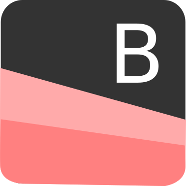

# Ireng Jambon Boilerplate Android


Ireng Jambon Android boilerplate

## Specification
- Dagger
- Kotlin
- Retrofit/Okhttp
- Picaso
- RxJava
- Android Architecture Room, LiveData, ViewModel
- MVVM Pattern
- Proguard Rule


## Usage
very easy to use just as a simple create view
- Create ViewModel and Provide it in the modul 
```
class MainViewModel @Inject constructor(val api:Api) :ViewModel() {

    public var state:MutableLiveData<State> = MutableLiveData()
    public var data:MutableLiveData<Pair<List<Contributor>?, Throwable>> = MutableLiveData()

    public fun getData(){
        asyncRxExecutor(api.getContributor(), state, {
            data.postValue(
                Pair(it, Throwable("null"))
            )
        }, {
            data.postValue(
                Pair(null, it)
            )
        })
    }

}
```


